import {
  GreenSquirrel,
  BlueRaven,
  BorderBlock,
  CssProperty,
} from "#src/html/oreilly"

看了眼标题之后的你可能会想，“表格布局？不是说尽量别用么？”确实，但本章并不打算用 table 元素去进行布局设计，而是着重讲解 CSS 如何影响表格。

相比于其他布局方式，表格算是比较不寻常的。在 Flexbox 和 Grid 诞生以前，表格中的各个元素的尺寸之间有着独特的相互影响 —— 例如，无论其中的某一个单元格中的内容的多少，一行中的每个单元格的高度都是相同，同理，一列中的每个单元格的宽度都是相同的。相邻的两个单元格可共享边框，即使他们的边框样式不同。

## 表格版式

在讲解如何计算单元格的尺寸和绘制其边框之前，我们需要先熟悉表格的组成，和单元格之间的联系。

### 从视觉上排列表格

首先要理解的是 CSS 如何影响表格的排列。

CSS 中将表格元素(table elements)和内部表格元素(internal table elements)做了区分。内部表格元素生成的盒子模型有内容、内边距和边框，但没有外边距。因此，无法通过定义外边距来分离两个内部表格元素。符合 CSS 标准的浏览器将会忽略内部表格元素的外边距属性。（表格标题除外，详细参考 link 表格标题 link 一章）

表格排列有 6 个规则，这些规则的基础是网格单元格，它是绘制表格的网格线之间的一个区域。图 14-1 中展示了两个表格，其中的网格单元格都用虚线展示了出来。

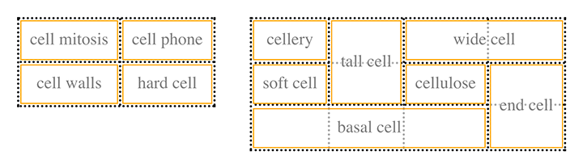

左侧的 2×2 表格中，网格单元与实际的表格单元格重合。右侧更复杂的表格中，一些单元格占用了多个网格单元，但每个单元格的边缘都沿着网格单元的边缘。

上述的网格单元格是一种用于更好地描述表格布局的抽象结构，其不可通过 DOM 访问和用 CSS 添加样式。

#### 表格布局规则

- 每个**行框(row box)**包含一行网格单元格。表格中的所有行框按照文档中出现的先后顺序从上到下占满表格（除了表头行框和表脚行框，它们分别处于表格的开头和结尾）。因此，表格包含的网格行数与行元素（tr 元素）的数目一样多。

- 一个**行组(row group)**包含与行框相同的网格单元。

- 一个**列框(column box)**包含一列或多列网格单元格。所有列框按照出现顺序依次排列。对从左到右阅读的语言来说，最左边一列是第一列；对从右到左阅读的语言，最右边一列是第一列。

- 一个**列组(column group)**包含与列框相同的网格单元。

- 单元格跨越多行或多列由文档语言来定义，而非 CSS。这样的单元格有一个或多个单元格宽或高。跨行列单元格的顶行是所有跨越行列的单元格的父行。单元格的网格，对于从左到右阅读的语言来说，必须尽可能靠左，且不能与其他单元格重叠，还要比同行中其他先于自己出现的单元格靠右；对于从右到左阅读的语言来说，必须尽可能靠右，且不能与其他单元格重叠，还要比同行中其他先于自己出现的单元格靠左。

- 每个单元格的框不能超出表格或行组的最后一行框。如果表格在定义时会出现这种情况，单元格会缩短，直到符合上述规则。

<BlueRaven>

CSS 规范只是不推荐，并不禁止定义表格元素或内部表格元素的具体位置。例如，定位包含跨行单元格的行可能会通过从表格中完全删除该行来显着改变表格的布局，从而在其他行的布局中删除跨单元格。即便如此，在现代浏览器中，修改表格元素的位置还是非常简单的。

</BlueRaven>

根据定义，单元格是矩形，但每个单元格的尺寸可能不尽相同。所有单元格在给定的列中有着相同的宽度，所有单元格在给定的行中有着相同的高度，不同行的高度可能不同，类似，不同列的宽度也有可能不同。

记住了表格布局基础规则，你可能会疑惑：具体如何直到哪个元素是单元哪个不是呢？

### 表格中的 `display` 属性

在 HTML 中，通过 tr 和 td 元素，我们很容易就能搞清楚表格的结构。另一方面，在 XML 中，无法从本质上知道哪些元素是表格的一部分。这里就该轮到 display 属性和它那一大堆值出场了。

<CssProperty>

<h1>display</h1>

<table>
  <tr>
    <th>值</th>
    <td>
      {
        "[ <display-outside> || <display-inside> ] | <display-listitem> | <display-internal> | <display-box> | <display-legacy>"
      }
    </td>
  </tr>
  <tr>
    <th>定义</th>
    <td>如下</td>
  </tr>
  <tr>
    <th>初始值</th>
    <td>inline</td>
  </tr>
  <tr>
    <th>适用元素</th>
    <td>所有元素</td>
  </tr>
  <tr>
    <th>计算值</th>
    <td>按规定计算</td>
  </tr>
  <tr>
    <th>继承父值</th>
    <td>否</td>
  </tr>
  <tr>
    <th>可动画</th>
    <td>否</td>
  </tr>
</table>

<ul>
  <li>{"<display-outside>"}</li>
  <div>{"block | inline | run-in"}</div>
  <li>{"<display-inside>"}</li>
  <div>{"flow | flow-root | table | flex | grid | ruby"}</div>
  <li>{"<display-listitem>"}</li>
  <div>{"list-item && <display-outside>? && [ flow | flow-root ]?"}</div>
  <li>{"<display-internal>"}</li>
  <div>
    {
      "table-row-group | table-header-group | table-footer-group | table-row | table-cell | table-column-group | table-column | table-caption | ruby-base | ruby-text | ruby-base-container | ruby-text-container"
    }
  </div>
  <li>{"<display-box>"}</li>
  <div>{"contents | none"}</div>
  <li>{"<display-legacy>"}</li>
  <div>
    {
      "inline-block | inline-list-item | inline-table | inline-flex | inline-grid"
    }
  </div>
</ul>

</CssProperty>

本章中，我们着重考察与表格相关的值，可总结位如下：

<ul typeless>
  
<li>table</li>

该值将元素指定为块级表格。因此，有着该定义的元素将生成一个块级盒子。对应的 HTML 元素为 table。

<li>inline-table</li>

该值将元素指定为行内表格。因此，有着该定义的元素将生成一个行内盒子。HTML 中的 table 默认为块级盒子。

<li>table-row</li>

该值将元素指定为表格的一行。对应的 HTML 为 tr 元素。

<li>table-row-group</li>

该值将元素指定为包括一或多行表格行。对应的 HTML 为 tbody 元素。

<li>table-header-group</li>

该值除了在视觉上可能有一些特殊格式，其余的和 table-row-group 很相似，头行总是在所有行和行组之前出现，且在标题之后出现。比如在打印时，如果表格跨越了多个纸张，用户代理可能会在新一张纸上先打印表头行。规范中没有明确说明如果将多个元素都定义为 table-header-group 时会如何，一个 header-group 可以包含多行。对应的 HTML 为 thead 元素。

<li>table-footer-group</li>

该值和 table-header-group 很相似，除了其总是在所有行和行组之后出现，且在尾标题之前出现。在打印时，如果表格跨越了多个纸张，用户代理可能会在每张纸的表格末尾重复打印尾标题。规范中没有明确说明如果将多个元素都定义为 table-footer-group 时会如何。对应的 HTML 为 tfoot 元素。

<li>table-column</li>

该值将元素指定为表格的一列。在 CSS 中，将 display 属性定义为该值的元素不会渲染，就如同将 display 定义为 none 一样。该值更多是为了帮助定义表格的列结构。对应的 HTML 为 col 元素。

<li>table-column-group</li>

该值将元素指定为包括一或多列表格列。与 table-column 类似，display 属性为该值的元素不会被渲染，其存在的意义更多是为了帮助定义表格的列结构。对应的 HTML 为 colgroup 元素。

<li>table-cell</li>

该值将元素指定为表格中的一个单元格。对应的 HTML 为 th 和 td 元素。

<li>table-caption</li>

该值将元素指定为表格的标题。CSS 没有规定如果多个元素的 display 属性被指定为该值时会如何，但有着明确的警告，“作者不应该在表格中放置多于一个 display 为 table-caption 的元素”。

</ul>

```css
table {
  display: table;
}
tr {
  display: table-row;
}
thead {
  display: table-header-group;
}
tbody {
  display: table-row-group;
}
tfoot {
  display: table-footer-group;
}
col {
  display: table-column;
}
colgroup {
  display: table-column-group;
}
td,
th {
  display: table-cell;
}
caption {
  display: table-caption;
}
```

在 XML 中，元素名称默认不具有语义，这些值就显得尤为重要。比如：

```xml
<scores>
  <headers>
    <label>Team</label>
    <label>Score</label>
  </headers>
  <game sport="MLB" league="NL">
    <team>
      <name>Reds</name>
      <score>8</score>
    </team>
    <team>
      <name>Cubs</name>
      <score>5</score>
    </team>
  </game>
</scores>
```

则可以通过如下代码来进行表格化：

```css
scores {
  display: table;
}
headers {
  display: table-header-group;
}
game {
  display: table-row-group;
}
team {
  display: table-row;
}
label,
name,
score {
  display: table-cell;
}
```

#### 行优先

CSS 中的表格模型有着“行优先”的特点。换句话说，该模型默认表格中的行都是显示(explicitly)定义的。另一方面，列将从各行中得出。因此，第一列由各行的第一个单元格组成，第二列由各行的第二个单元格组成，以此类推。

行优先在 HTML 中不成问题，该语言本身就是**面向行(row-oriented)**的。但在 XML 中就显得有些棘手了，因为它限制了作者定义表格的方式。由于 CSS 表格模型的面向行的特性，以列为表格布局基础的标记语言实际上是不可能的（假设意图是使用 CSS 来呈现此类文档）。

#### 列

尽管 CSS 表格模型是面向行的，列在表格布局中也很重要。一个单元格可以同时属于两者（行和列），即使在文档中它是行元素的子元素。然而在 CSS 中，列和列组只能接收四个属性：border、background、width 和 visibility。

此外，这四个属性中的每一个都有特殊规则：

<ul typeless>

<li>border</li>

如果 border-collapse 属性设置为 collapse，则边框可以设置在列和列组上。这种情况下，列和列组的边框会参与到设置每一个单元格的边框样式和边框折叠算法中。（详见 hash 单元格边框的折叠 hash）

<li>background</li>

列和列组的背景，仅在单元格和单元格所在的行没有设置背景的情况下才会显示。（详见 hash 表格结构分层 hash）

<li>width</li>

width 属性定义列和列组的最小宽度。列或列组中的单元格的内容可能会强制使列宽变大。

<li>visibility</li>

如果列或列组的 visibility 属性的值为 collapse，则其中的单元格不会被渲染。跨列单元格将会被裁剪。另外，表格的总宽度也会减小，列和列组会忽略 visibility 属性不为 hidden 的声明。

</ul>

### 匿名表格对象

若是在用 HTML 描述表格结构时，不小心丢失或漏写了一部分，如下：

```html
<table>
  <td>姓名:</td>
  <td><input type="text" /></td>
</table>
```

乍一看，你可能会觉得这个表格定义了一行两列，但结构上来讲，没有定义行结构的元素（因为没有写 tr 元素）。

考虑到这种情况，CSS 中专门有一种机制，以匿名对象的方式来插入丢失的元素。还是上面的例子，在 CSS 中，一个匿名的表格行元素将被插入：

```html
<table>
  <!--anonymous table-row object begins-->
  <td>Name:</td>
  <td><input type="text" /></td>
  <!--anonymous table-row object ends-->
</table>
```

图 14-2 给出了视觉效果，虚线代表插入的匿名表格行。

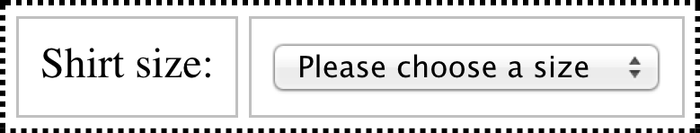

在 CSS 表格模型中，总共有 7 种可供插入的匿名对象。

<ol>

<li>

如果一个 table-cell 元素的父元素不是 table-row 元素，那么，将在其和父元素之间插入一个 table-row 元素。新插入的元素会将会把所有连续的 table-cell 当作其子元素。举个例子：

```css
system {
  display: table;
}
name,
moons {
  display: table-cell;
}
```

```xml
<system>
 <name>Mercury</name>
 <moons>0</moons>
</system>
```

匿名 table-row 对象会在单元格元素和 system 元素之间插入，并将 name 和 moons 元素作为其子元素。

这种情况也适用于父元素是 table-row-group 元素的情况，例如：

```css
system {
  display: table;
}
planet {
  display: table-row-group;
}
name,
moons {
  display: table-cell;
}
```

```xml
<system>
  <planet>
    <name>Mercury</name>
    <moons>0</moons>
  </planet>
  <planet>
    <name>Venus</name>
    <moons>0</moons>
  </planet>
</system>
```

这种情况下，两组单元格都将包含在插入它们和行星元素之间的匿名表行对象中。

</li>

<li>

如果 table-row 元素的父元素不是 table、inline-table 或 table-row-group 元素，那么，将在其和父元素之间插入一个 table 元素。插入的元素会把所有连续的 table-row 元素作为其子元素，举个例子：

```css
docbody {
  display: block;
}
planet {
  display: table-row;
}
```

```xml
<docbody>
  <planet>
    <name>Mercury</name>
    <moons>0</moons>
  </planet>
  <planet>
    <name>Venus</name>
    <moons>0</moons>
  </planet>
</docbody>
```

由于 planet 元素的父元素 docbody 的 display 属性值为 block，会在 docbody 和 planet 元素之间插入一个 table 元素，该 table 元素会将两个连续的 planet 元素均纳为其子元素。

</li>

<li>

如果一个 table-column 元素的父元素不是 table、inline-table 或 table-column-group 元素，那么，一个 table 元素会在其和父元素之间插入。这种情况和 table-row 的情况类似，只不过是针对表格列的。

</li>

<li>

如果一个 table-row-group、table-header-group、table-footer-group、table-column-group 或 table-caption 元素的父元素不是 table 元素，那么，将在其和父元素之间插入一个 table 元素。

</li>

<li>

如果一个 table、inline-table 元素的子元素不是 table-row-group、table-header-group、table-footer-group、table-row、或 table-caption 元素，那么，其和子元素之间会插入一个 table-row 元素。该插入的元素将所有非 table-row-group、table-headergroup、 table-footer-group、table-row 或 table-caption 的子元素作为其子元素。例如：

```css
system {
  display: table;
}
planet {
  display: table-row;
}
name,
moons {
  display: table-cell;
}
```

```xml
<system>
  <planet>
    <name>Mercury</name>
    <moons>0</moons>
  </planet>
  <name>Venus</name>
  <moons>0</moons>
</system>
```

一个 table-row 元素将被插入到 system 元素和第二组 name 和 moons 元素之间。planet 元素没有被囊括其中是因为其 display 的值为 table-row。

</li>

<li>

如果一个 table-row-group、table-header-group 或 table-footer-group 的子元素不是 table-row 元素，那么，将在其和其子元素之间插入一个 table-row 元素。该 table-row 元素会将所有连续的非 table-row 元素作为其子元素。例如：

```css
system {
  display: table;
}
planet {
  display: table-row-group;
}
name,
moons {
  display: table-cell;
}
```

```xml
<system>
  <planet>
    <name>Mercury</name>
    <moons>0</moons>
  </planet>
  <name>Venus</name>
  <moons>0</moons>
</system>
```

这种情况下，两组 name 和 moons 元素都会被一个 table-row 元素包住。对于第二组来说，按照规则 5 生成；
对于第一组来说，在 planet 和其子元素之间插入，因为 planet 元素是一个 table-row-group 元素。

</li>

<li>

如果一个 table-row 元素的子元素不是 table-cell 元素，那么，会在其和其子元素之间插入一个 table-cell 元素。该元素会包含所有连续的且不是 table-cell 的元素。例如：

```css
system {
  display: table;
}
planet {
  display: table-row;
}
name,
moons {
  display: table-cell;
}
```

```xml
<system>
  <planet>
    <name>Mercury</name>
    <num>0</num>
  </planet>
</system>
```

因为 num 元素的 display 属性值不是与表格相关的值，一个 table-cell 将被在 planet 元素和 num 元素之间。

这种行为同样使用行内盒子。假设数字 0 没有被 num 元素包裹：

```xml
<system>
  <planet>
    <name>Mercury</name>
    0
  </planet>
</system>
```

0 仍然会被包括进新生成的 table-cell 元素种。例如：

```css
example {
  display: table-cell; // 存疑，原书这里可能有误，此处应该是 table
}
row {
  display: table-row;
}
hey {
  font-weight: 900;
}
```

```xml
<example>
  <row>This is the <hey>top</hey> row.</row>
  <row>This is the <hey>bottom</hey> row.</row>
</example>
```

在每个 row 元素中，文本和 hey 元素会被包进新生成的 table-cell 元素中。

</li>

</ol>

### 表格结构分层

为了描述表格的组成，CSS 中定义了 6 个不同的层。如图 14-3 所示。

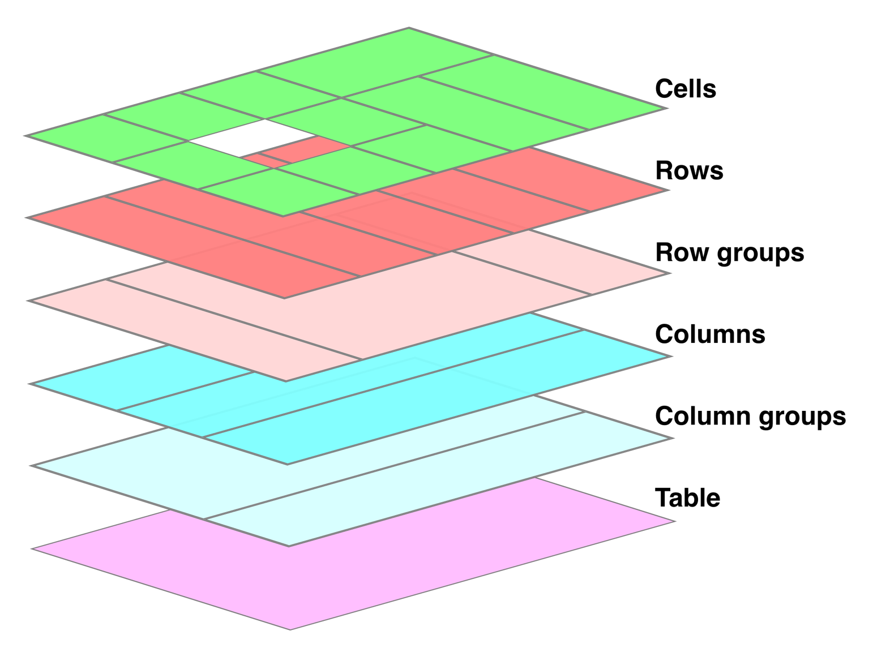

基本上，表格的每一层的样式都绘制在各自的层面上。因此，如果表格有着绿色的背景和 1 像素宽黑色边框，那么，这些样式将会绘制在最底层。列组的任何样式将会在此之上进行绘制，列的样式又会在更上一层绘制，以此类推。最顶层是单元格自身的样式，最后绘制。

在大多数情况下，这是一个合乎逻辑的过程；毕竟，如果为一个单元格定义了背景色，我们的意图肯定是将其显示在表格的背景色之上。图 14-3 最值得注意的点是，列和列组在行和行组的下面，所以行背景会显示在列背景之上。

默认情况下，所有元素的背景色都是透明的。因此，在如下的例子中，表格元素的背景会透过单元格、行、列，最终被用户看到，如 14-4 所示：

```html
<table style="background: #B84;">
  <tr>
    <td>hey</td>
    <td style="background: #ABC;">there</td>
  </tr>
  <tr>
    <td>what’s</td>
    <td>up?</td>
  </tr>
  <tr style="background: #CBA;">
    <td>not</td>
    <td style="background: #ECC;">much</td>
  </tr>
</table>
```

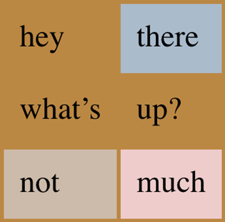

### 表格标题

表格的标题是一段用于描述表格所展示的内容的大意的文字。因此，2016 年第四季度的股票报价图表可能有一个标题元素，其内容为“2016 年第四季度股票表现”。通过属性 caption-side，可以决定标题显示在表格的上方还是下方，无论其在文档中的位置。（在 HTML5 中，caption 元素只能是 table 元素的首个子元素，但其他语言可能有不同的规则）

<CssProperty>

<h1>caption-side</h1>

<table>
  <tr>
    <th>值</th>
    <td>{"top | bottom"}</td>
  </tr>
  <tr>
    <th>初始值</th>
    <td>top</td>
  </tr>
  <tr>
    <th>适用元素</th>
    <td>所有 display 值为 table-caption 的元素</td>
  </tr>
  <tr>
    <th>计算值</th>
    <td>按规定计算</td>
  </tr>
  <tr>
    <th>继承父值</th>
    <td>是</td>
  </tr>
  <tr>
    <th>可动画</th>
    <td>否</td>
  </tr>
  <tr>
    <th>注释</th>
    <td>
      left 和 right 值与 CSS2 中被引入，但由于缺乏广泛支持，又在 CSS2.1
      中被舍去。
    </td>
  </tr>
</table>

</CssProperty>

在视觉上来说，标题表现得有些奇怪。CSS 规范中，标题会被格式化为一个块级盒子，放在表格盒子之前（或之后），但有一处例外，就是标题仍能从表格中继承数值。

考虑如下代码，其结果如图片 14-5 所示。

```css
caption {
  background: #b84;
  margin: 1em 0;
  caption-side: top;
}
table {
  color: white;
  background: #840;
  margin: 0.5em 0;
}
```

标题元素中的文字继承了表格元素的`color: white`，但没有继承背景色。标题和表格之间的间隔是 1em，标题和表格的外边距折叠后取最大值。最后，标题宽度与表格宽度相同。

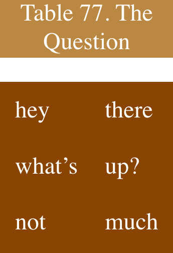

若将 caption-side 改为 bottom 也会得到相同的结果，但标题会显示在表格下面。

大多数情况下，标题就如同块级元素一般，可以有内边距、边框、背景色等属性。例如，我们可以通过 text-align 设置为 right，将标题中的文本靠右排列。

```css
caption {
  background: gray;
  margin: 1em 0;
  caption-side: top;
  text-align: right;
}
```

## 表格单元格的边框

CSS 中有两种边框模型：一个是单元格之间相互分离的，分离式边框模型；和单元格之间没有视觉上的隔离，边框相互融合的，折叠式边框模型。前者是默认模型，但在早期 CSS 中，后者是默认模型。

我们可以通过 border-collapse 属性来决定使用哪种边框模型。

<CssProperty>

<h1>border-collapse</h1>

<table>
  <tr>
    <th>值</th>
    <td>{"collapse | separate | inherit"}</td>
  </tr>
  <tr>
    <th>初始值</th>
    <td>separate</td>
  </tr>
  <tr>
    <th>适用元素</th>
    <td>所有 display 值为 table 或 table-inline 的元素</td>
  </tr>
  <tr>
    <th>继承父值</th>
    <td>是</td>
  </tr>
  <tr>
    <th>计算值</th>
    <td>按规定计算</td>
  </tr>
  <tr>
    <th>注释</th>
    <td>在CSS2中，默认值是 collapse。</td>
  </tr>
</table>

</CssProperty>

我们先来看一下该属性值为 separate 时的情况。

### 分离式单元格边框

在此模型下，每一个单元格都与其他单元格有一定距离，相邻单元格的边框也不会相互重叠。图 14-6 展示了如下代码的渲染结果。

```css
table {
  border-collapse: separate;
}
td {
  border: 3px double black;
  padding: 3px;
}
tr:nth-child(2) td:nth-child(2) {
  border-color: gray;
}
```

```html
<table cellspacing="0">
  <tr>
    <td>cell one</td>
    <td>cell two</td>
  </tr>
  <tr>
    <td>cell three</td>
    <td>cell four</td>
  </tr>
</table>
```

注意到，单元格的边框之间有明显的分离。两个单元格之间的三条线，实际上是两个双线边框挨在了一起。第四个单元格的边框是灰色的，能帮助我们更好地区分。

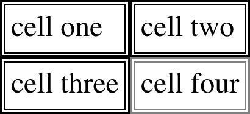

HTML 属性 cellspacing 确保单元格之间相互紧邻，但该值的出现有些 XXXXXX。毕竟，能定义边框之间是分离的，那么也应该能用 CSS 定义分离的距离。幸运的是，还真能。

#### 边框分离

border-spacing 属性可以控制分离式边框模型下，两个单元格边框之间隔开的距离的大小，该属性比 cellspacing 更加强大。

<CssProperty>

<h1>border-spacing</h1>

<table>
  <tr>
    <th>值</th>
    <td>{"<length> <length>?"}</td>
  </tr>
  <tr>
    <th>初始值</th>
    <td>0</td>
  </tr>
  <tr>
    <th>适用元素</th>
    <td>所有 display 值为 table 或 table-inline 的元素</td>
  </tr>
  <tr>
    <th>计算值</th>
    <td>两个长度值</td>
  </tr>
  <tr>
    <th>继承父值</th>
    <td>是</td>
  </tr>
  <tr>
    <th>能否动画</th>
    <td>能</td>
  </tr>
  <tr>
    <th>注释</th>
    <td>在非分离式边框模型下会忽略该属性。</td>
  </tr>
</table>

</CssProperty>

该属性的值可以是一个或两个长度值。一个值的情况，如 1px，两个单元格之间的间隔是 1px；两个值的情况，如 1px 5px，水平方向上，两个单元格的间隔是 1px，垂直方向上是 5px。

图 14-7 展示了下面代码的结果：

```css
table {
  border-collapse: separate;
  border-spacing: 5px 8px;
  padding: 12px;
  border: 2px solid black;
}
td {
  border: 1px solid gray;
}
td#squeeze {
  border-width: 5px;
}
```

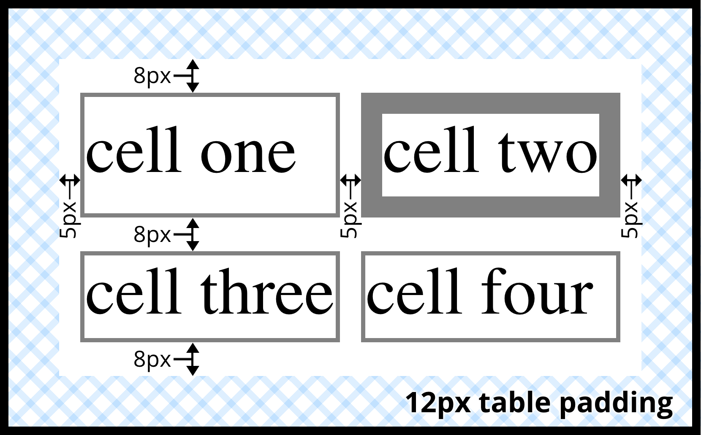

在图片 14-7 中，水平方向的间隔是 5px，表格有 12px 的内边距，所以表格边框的外层到最近的单元格的边框的距离是 17px；类似地，垂直方向的间隔是 8px，所以表格边框的外层到最近的单元格的边框的距离是 20px。表格内每个单元格之间间距也是水平方向 5px，垂直方向 8px，与单元格边框宽度无关。

border-spacing 属性是定义在表格元素上的，而非具体某个单元格。定义在 td 元素上的 border-spacing 会被忽略。

在分离式边框模型中，无法单独为行，行组，列，列组设置间隔距离。用户代理应该忽略为这些元素声明的任何边框属性。

#### 处理空单元格

从视觉上来讲，每个单元格都是相互独立的，那我们应该怎样处理空（没有实际内容的）单元格呢？有两种办法，正好对应着 empty-cells 属性的两个值。

<CssProperty>

<h1>empty-cells</h1>

<table>
  <tr>
    <th>值</th>
    <td>{"show | hide"}</td>
  </tr>
  <tr>
    <th>初始值</th>
    <td>show</td>
  </tr>
  <tr>
    <th>适用元素</th>
    <td>所有 display 值为 table-cell 的元素</td>
  </tr>
  <tr>
    <th>计算值</th>
    <td>根据定义计算</td>
  </tr>
  <tr>
    <th>继承父值</th>
    <td>是</td>
  </tr>
  <tr>
    <th>能否动画</th>
    <td>否</td>
  </tr>
  <tr>
    <th>注释</th>
    <td>在非分离式边框模型下会忽略该属性。</td>
  </tr>
</table>

</CssProperty>

如果 empty-cell 定义为 show，空单元格的边框和背景将被绘制，就和普通的单元格一样。如果是 hide，则该单元格将不被绘制，就和将 visibility 属性设置为 hidden 一样。

如果单元格包含内容，则不会被当成空单元格。这里的内容不仅仅指代文字、图片或是其他元素，也包括非换行空格 ({`&nbsp;`}) 、任何除了 CR(carriage return)、LF(line feed)、tab 和空格的空白字符。如果某一行的所有单元格内容都为空，且都有 empty-cell: hide，则不会显示改行。

### 折叠式单元格边框

折叠式边框模型描述的是 HTML 中的表格的单元格在没有间隔时如何布局，比之前的分离式模型稍微复杂一些。同样，他也有一些自己的规则：

- 当 border-collapse 设置为 collapse 时，display 值为 table 或 inline-table 的元素没有内边距，但可以有外边距。因此，折叠式边框模型下，表格边框和最外层单元格的边缘之间没有间隔。

- 单元格、行、行组、列和列组都可以有边框，表格也可以有自己的边框。

- 折叠式边框模型下，单元格之间没有间隔，他们在相邻时相互重叠，只画出一条线。这和外边距塌陷类似，总是取最大值。当边框塌陷时，总是取最“有趣”的边框。

- 当边框塌陷时，单元格之间的边框，将在假想的网格系统中居中。

下面两个小节我们来详细解释最后两点。

#### 塌陷边框布局

为了能更好的理解，塌陷式边框模型如何工作，我们先拿一行来举例子，如图 14-8。

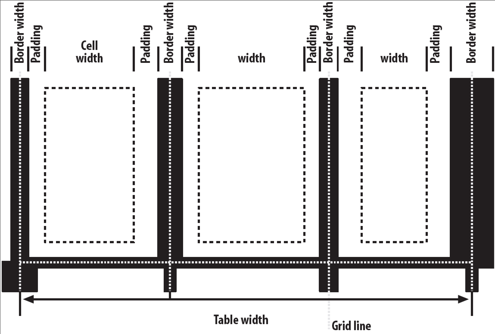

每个单元格的内边距和内容，都在边框之内。对于单元格之间的边框，一半处于一个单元格，另一半处于另一个单元格。每个单元格的边缘，只绘制一条边框。该边框整体属于一个边框，而不是每个单元格都画了一半边框。

比如，假设中间的单元格的边框为绿色，外部的两个单元格的边框为红色。中间单元格的左右两个边框不是红色就是绿色，取决于那个边框最后能胜出。下一小节我们来讲解边框胜出的规则。

你可能注意到了，最外层边框有一半超出了表格。这是因为在该模型下，一半的表格的边框算在了表格宽度里。另一半向外伸出，坐落在外边距中。该模型的工作方式就是这么奇怪。

下面我们给出行宽的准确计算公式：

```table
   行宽 = (0.5 * 第0个边框宽度) + 左内边距1 + 宽度1 + 右内边距1 + 边框宽度1 + 左内边距2
          + ... + 右内边距n + (0.5 * 第n个边框宽度)

   row width = (0.5 * border-width-0) + padding-left-1 + width-1 + padding-right-1
               + border-width-1 + padding-left-2 +...+ padding-right-n + (0.5 * border-width-n)
```

每个 border-width-n 指代第 n 个单元格和下一个单元格之间的边框宽度；因此，border-width-3 指代第 3 和第 4 个单元格之间的边框。n 代表一行内单元格的个数。

这里还有一个小例外。当开始布局边框塌陷的表格时，用户代理会先计算出表格的初始左右边框。表格中首行首个单元格的左边框宽度的一半，作为表格的初始左边框宽度。右边同样，用首行最后一个单元格计算。若其他行的首个单元格的边框宽度，超过了表格初始边框宽度，会将超出的宽度放在外边距的区域中。

在边框是奇数个显示元素（像素、打印机点等）宽的情况下，用户代理将决定如何将边框居中放置在网格线上。 它可能会移动边框，使其稍微偏离中心，向上或向下舍入为偶数个显示元素，使用抗锯齿，或调整任何其他看起来合理的东西。(google translate)

#### 边框塌陷

当两个或多个边框相邻，他们会塌陷到一起。准确的说，胜出的边框会完全取代没有胜出的边框。下面是边框胜出的规则：

- 边框塌陷时，如果其中一个元素有`border-style: hidden`，那么该边框胜出，该单元格的所有边框都不会被绘制。

- 若所有的边框都可见，则宽的边框胜出。例如，2px 宽的虚线边框和 5px 双线边框的两个元素相邻，最终两者之间的边框样式为 5px 的双线边框。

- 若宽度相同，但有着不同的边框样式。则胜出规律如下： double, solid, dashed, dotted, ridge, outset, groove, inset, none。例如，两个单元格的边框宽度相同，但一个是 dashed，另一个是 outset，那么两者之间的边框样式为 dashed。

- 若宽度和样式都相同，但颜色不同，那么将会按照如下顺序的元素中定义的颜色来优先选取：单元格、行、行组、列、列组、表格。例如，一个表格中某列和该列中的某个单元格都定义了边框样式，只有边框颜色不相同，那么该单元格的边框颜色以单元格自身定义的为准；若是两个塌陷的边框的颜色定义均来自同一级优先级，那么，从左到右阅读顺序的语言中，选取靠近右下的元素中定义的颜色，从右到左阅读顺序的语言中，则选取靠近最下的元素中定义的颜色。

图 14-9 中展示了如下代码的结果：

```css
table {
  border-collapse: collapse;
  border: 3px outset gray;
}
td {
  border: 1px solid gray;
  padding: 0.5em;
}
#r2c1,
#r2c2 {
  border-style: hidden;
}
#r1c1,
#r1c4 {
  border-width: 5px;
}
#r2c4 {
  border-style: double;
  border-width: 3px;
}
#r3c4 {
  border-style: dotted;
  border-width: 2px;
}
#r4c1 {
  border-bottom-style: hidden;
}
#r4c3 {
  border-top: 13px solid silver;
}
```

```html
<table>
  <tr>
    <td id="r1c1">1-1</td>
    <td id="r1c2">1-2</td>
    <td id="r1c3">1-3</td>
    <td id="r1c4">1-4</td>
  </tr>
  <tr>
    <td id="r2c1">2-1</td>
    <td id="r2c2">2-2</td>
    <td id="r2c3">2-3</td>
    <td id="r2c4">2-4</td>
  </tr>
  <tr>
    <td id="r3c1">3-1</td>
    <td id="r3c2">3-2</td>
    <td id="r3c3">3-3</td>
    <td id="r3c4">3-4</td>
  </tr>
  <tr>
    <td id="r4c1">4-1</td>
    <td id="r4c2">4-2</td>
    <td id="r4c3">4-3</td>
    <td id="r4c4">4-4</td>
  </tr>
</table>
```

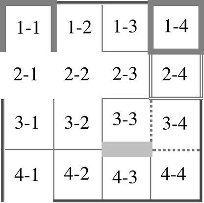

下面来具体说明，每个单元格中具体发生了什么：

- 单元格 1-1 到 1-4，5px 的宽度比相邻的元素和表格本身的都宽，但 1-1 的底边框是个例外。

- 由于 2-1 和 2-2 的边框样式为 hidden，故这两个单元格没有绘制边框，也导致 1-1 的底边框和其与表格重合部分的边框也是 hidden。4-1 的底边框也被设置为了 hidden。

- 2-4 的 3px 双线边框被 1-4 的 5px 边框覆盖，由于宽度 1-4 胜出。同样，2-4 也胜出了 2-3 从 td 中继承的实线边框，和 3-4 的虚线边框。

- 4-3 中定义的 13px 宽的银色底边框胜出了 3-3 的边框。由于该边框过宽，也影响到了两个单元格中内容的布局。（可从对齐方式中看出）

- 对于其他外层单元格的 1px 外侧边框，表格的 3px 边框胜出。

规则中大多都是人为的定义，比如哪个边框样式更有趣。下面的图 14-10 是网景 1-1 表格展示：(need re-translate)

```css
table {
  border-collapse: collapse;
  border: 2px outset gray;
}
td {
  border: 1px inset gray;
}
```

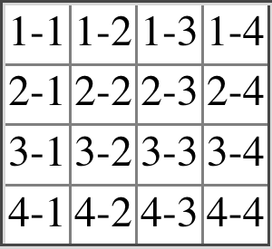

## 表格尺寸

了解了表格排版和边框样式之后，终于到了和单元格本身有关的点了。如何决定单元格的宽度，主要有两种方式：定宽布局(fixed-width layout)和自动布局(automatic-width layout)。无论是哪一种，高度都是自动计算的。

### 宽度

既然有两种可选方案，那必然就存在一个对应的 CSS 属性。开发者可以通过设置 table-layout 属性来决定使用哪一种宽度方案。

<CssProperty>

<h1>table-layout</h1>

<table>
  <tr>
    <th>值</th>
    <td>{"auto | fixed"}</td>
  </tr>
  <tr>
    <th>初始值</th>
    <td>auto</td>
  </tr>
  <tr>
    <th>适用元素</th>
    <td>所有 display 值为 table 或 inline-table 的元素</td>
  </tr>
  <tr>
    <th>计算值</th>
    <td>根据定义计算</td>
  </tr>
  <tr>
    <th>继承父值</th>
    <td>是</td>
  </tr>
  <tr>
    <th>能否动画</th>
    <td>否</td>
  </tr>
</table>

</CssProperty>

这两种方式自然有着不同的结果，主要的不同是在速度上。定宽表格下，用户代理一般会比自动宽度下要快。

#### 定宽布局

定宽布局的速度要快，其主要原因是，这种布局不依赖于单元格中的内容，而完全由表格、列和单元格的 width 属性决定。

定宽布局的工作流程如下：

<ol>
  <li>若设置某列的宽度为非 auto，那么该列中的左右单元格的宽度都将为该值。</li>
  <ol>
    <li>
      若列的宽度为 auto，但该列的首航单元格的宽度不是
      auto，则整列的宽度与该单元格的定宽相同。若是该单元格跨越多列，那么宽度将在多列中均分。
    </li>
    <li>其余自动宽度的列的宽度，将尽可能保持相同。</li>
  </ol>
</ol>

此时，表格的宽度为表格的定宽和每列宽度之和中的较大值。若表格的定宽较大，则多出的空间将平均分给每列。

这种布局方式较快，是因为所有列的宽度都由首行的单元格决定。之后每行的单元格不会，也不能改变该列的宽度，被赋予的 width 属性也会被忽略。若单元格中的内容尺寸较大，则由 overflow 属性决定如何显示。

考虑如下代码，其结果如图 14-11 所示：

```css
table {
  table-layout: fixed;
  width: 400px;
  border-collapse: collapse;
}
td {
  border: 1px solid;
}
col#c1 {
  width: 200px;
}
#r1c2 {
  width: 75px;
}
#r2c3 {
  width: 500px;
}
```

```html
<table>
  <colgroup>
    <col id="c1" />
    <col id="c2" />
    <col id="c3" />
    <col id="c4" />
  </colgroup>
  <tr>
    <td id="r1c1">1-1</td>
    <td id="r1c2">1-2</td>
    <td id="r1c3">1-3</td>
    <td id="r1c4">1-4</td>
  </tr>
  <tr>
    <td id="r2c1">2-1</td>
    <td id="r2c2">2-2</td>
    <td id="r2c3">2-3</td>
    <td id="r2c4">2-4</td>
  </tr>
  <tr>
    <td id="r3c1">3-1</td>
    <td id="r3c2">3-2</td>
    <td id="r3c3">3-3</td>
    <td id="r3c4">3-4</td>
  </tr>
  <tr>
    <td id="r4c1">4-1</td>
    <td id="r4c2">4-2</td>
    <td id="r4c3">4-3</td>
    <td id="r4c4">4-4</td>
  </tr>
</table>
```

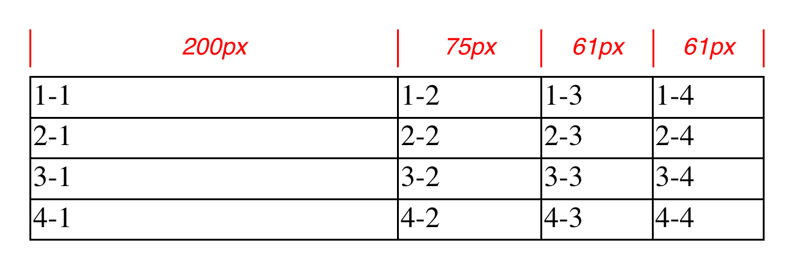

如图 14-11 所示，第一列的宽度为 200px，为表格宽度 400px 的一半。第二列的宽度为 75px，因为单元格 1-2 的宽度为定长 75px。第三、四列都是 61px，因为前两列的宽度和是 275px，加上 3px 的边框一共是 278px，剩余 400px - 278px = 122px，由两列均分得出 61px。而单元格 2-3 定义的 500px 被忽略了，由于其不是该列的首行元素。

注意，并不是只有显示定义了宽度的表格才算定宽布局。例如，在如下代码中，用户代理能根据计算得出，表格的宽度要比其父元素小 50px，之后会将该值用于定宽布局的计算中：

```css
table {
  table-layout: fixed;
  margin: 0 25px;
  width: auto;
}
```

另外提一句，用户代理也允许针对 width 是 auto 的表格使用自动宽度布局模型。

#### 自动布局

自动宽度布局，虽然比固定宽度布局稍慢，但作为 HTML 表格的默认值，你可能已经很熟悉了。在现代用户代理中，该模型会作用在所有 width 为 auto 的表格上，无论 table-layout 的值为何（不保证一定会用）。

该种模型的速度慢是因为，如果用户代理不遍历过每个单元格中的内容，是无法决定表格的宽度的。这种布局会将每个单元格的样式都考虑进内，这一般需要用户代理计算完每个单元格的宽度后，在返回到表格中做整理来决定最后的宽度。

在决定表格的宽度之前，其中的每个单元格都需要计算出宽度。比如在表格的最后一行的某个单元格中，有一个 400px 宽的图片，则会使同列的所有单元格的宽度都至少为 400px。

具体的计算流程如下：

<ol>
  <li>每列中的单元格，计算最小和最大单元格宽度。</li>
  <ol>
    <li>
      决定能显示内容的最小宽度。在计算最小宽度的过程中，单元格的内容可以被断成多行，但不一定会超出单元格区域。若单元格设置了
      width 属性，且比最小宽度大，那么最小单元格的宽度与该 width
      的值相同。若单元格的 width 属性设置为
      auto，那么最小单元格的宽度与最小内容宽度相同。
    </li>
    <li>在计算最大宽度时，无需将内容断成多行，除非使用 br 元素强制断行。</li>
  </ol>
  <li>对于每一列，计算最小和最大列宽。</li>
  <ol>
    <li>aaaa</li>
    <li>bbbb</li>
  </ol>
  <li>333333</li>
</ol>

当且仅当最后一步完成后，用户代理才会开始布局表格。

为了更进一步理解，图片 14-12 展示了如下代码的结果：

```css
table {
  table-layout: auto;
  width: auto;
  border-collapse: collapse;
}
td {
  border: 1px solid;
  padding: 0;
}
col#c3 {
  width: 25%;
}
#r1c2 {
  width: 40%;
}
#r2c2 {
  width: 50px;
}
#r2c3 {
  width: 35px;
}
#r4c1 {
  width: 100px;
}
#r4c4 {
  width: 1px;
}
```

```html
<table>
  <colgroup>
    <col id="c1" />
    <col id="c2" />
    <col id="c3" />
    <col id="c4" />
  </colgroup>
  <tr>
    <td id="r1c1">1-1</td>
    <td id="r1c2">1-2</td>
    <td id="r1c3">1-3</td>
    <td id="r1c4">1-4</td>
  </tr>
  <tr>
    <td id="r2c1">2-1</td>
    <td id="r2c2">2-2</td>
    <td id="r2c3">2-3</td>
    <td id="r2c4">2-4</td>
  </tr>
  <tr>
    <td id="r3c1">3-1</td>
    <td id="r3c2">3-2</td>
    <td id="r3c3">3-3</td>
    <td id="r3c4">3-4</td>
  </tr>
  <tr>
    <td id="r4c1">4-1</td>
    <td id="r4c2">4-2</td>
    <td id="r4c3">4-3</td>
    <td id="r4c4">4-4</td>
  </tr>
</table>
```

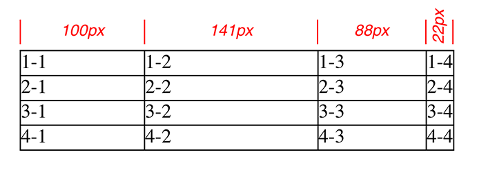

下面来解释每个单元格中都发生了什么：

- 在第一列中，只有单元格 4-1 显示设置了具体宽度 100px。但由于单元格中的内容过短，最小和最大列宽都设置为了 100px。（若该列中有内容比较长的单元格，则最大列宽值会增加，为在不断行的情况下能全部显示单元格中的内容所需的宽度。）

- 第二列中，有两个单元格设置了宽度，1-2 为 40%，2-2 为 50px。则该列的最小列宽为 50px，最大列宽为表格宽度的 40%。

- 第三列中，只有 3-3 设置了宽度 35px，但列本身设置了 25%的宽度。因此，最小列宽为 35px，最大列宽为表格宽度的 25%。

- 第四列中，只有 4-4 设置了宽度 1px。这远比最小内容宽度要小，所以最小和最大列宽都设置为该单元格的最小内容宽度，也就是显示“4-4”这 3 个文本字符所需的宽度。经计算该值为 22px，所以最小和最大宽度均为 22px。

此时，用户代理明确了这四列的最小和最大宽度：

- 最小 100px，最大 100px
- 最小 50px， 最大 40%
- 最小 35px， 最大 25%
- 最小 25px， 最大 22px

因此，该表格的最小宽度，为所有列的最小宽度之和，外加列之间的边框宽度，即 215px；该表格的最大宽度为 123px + 65%，123px 源自第一、四列宽和边框宽度。表格的最大宽度计算后为 351.42857142857143px。（考虑到 123px 为 35%的表格宽度。）有了这个数，便能算出第二列的最大宽度为 140.5px，第三列为 87.8px。这些小数之后可能会被四舍五入为整数 141px 和 88px，也可能不会，取决于具体使用的渲染方法。

注意，用户代理也可能不会使用以上计算出来的数值，而是采取其他方案。

如上是一个相对较简单、直观的例子：所有的单元格中内容的宽度都相同，大多数宽度通过像素定义。当单元格中有图片、大段文字、表单元素等，计算表格的宽度时可能要复杂的更多。

### 高度

费了半天劲，弄懂了表格的宽度如何计算，你可能会想高度又会是多么地复杂。事实上挺简单的，但浏览器开发者可能不这么想。

最简单的情况还是通过 height 属性直接赋值，这种情况下，表格的可能高于或矮于所有行高的总和。注意，这里的 height 更类似于 min-height，即若是赋予给 height 属性的值比实际所需高度小，那么它很有可能会被忽略。

相反地，若是定义的高度比总行高大，规范中并没有定义应该如何应对，。用户代理可以选择增大表格的高度，或是在单元格中留出空白，或是其他做法，完全取决于用户代理。

<BlueRaven>

2017 下半年，用户代理通常会将多余的高度均分给每一行。

</BlueRaven>

若 height 的值为 auto，那么表格的高度为每一行高度总和外加边框宽度。用户代理通过和决定宽度类似的方式，浏览所有的行来决定行高。它为每个单元格计算可能的最大和最小高度，然后通过这些值决定每行的最大和最小高度，最后决定每行的具体高度，一行一行地罗上去，最终得出表格的高度。类似行内布局，但少了一些确定性。

除了如何处理具有显式高度的表格以及如何处理其中的行高之外，您还可以将以下内容添加到 CSS 未定义的列表中：(g-t)

- 表格单元格的高度是百分比的情况
- 表格行和行组的高度是百分比的情况
- 跨行单元格如何影响行高，

如您所见，表格中的高度计算主要由用户代理来计算。 历史证据表明，这将导致每个用户代理执行不同的操作，因此您应该尽可能避免设置表格高度。(g-t)

### 对齐

单元格中内容的对齐方式，比处理高度要定义得好得多。垂直对齐也是如此，且很容易影响行高。

水平对其是最简单的，单元格就像一个块级盒子，可以用 text-align 属性。

垂直对齐单元格中的内容，vertical-align 是一个相关的属性。该属性在描述表格时，与描述一般行内元素有很大区别：

<ul>
  <li>top</li>

单元格内容的顶部与行的顶部对齐；跨行单元格的情况，其内容与最上面的单元格的顶部对齐。

{" "}

<li>bottom</li>

单元格内容的底部与行的底部对齐；跨行单元格的情况，其内容与最下面的单元格的底部对齐。

{" "}

<li>middle</li>

单元格内容的中部与行的中部对齐；跨行单元格的情况，其内容与最中间的单元格的中部对齐。

</ul>

图 14-13 展示了如下代码的渲染结果：

```css
table {
  table-layout: auto;
  width: 20em;
  border-collapse: separate;
  border-spacing: 3px;
}
td {
  border: 1px solid;
  background: silver;
  padding: 0;
}
div {
  border: 1px dashed gray;
  background: white;
}
#r1c1 {
  vertical-align: top;
  height: 10em;
}
#r1c2 {
  vertical-align: middle;
}
#r1c3 {
  vertical-align: bottom;
}
```

```html
<table>
  <tr>
    <td id="r1c1">
      <div>The contents of this cell are top-aligned.</div>
    </td>
    <td id="r1c2">
      <div>The contents of this cell are middle-aligned.</div>
    </td>
    <td id="r1c3">
      <div>The contents of this cell are bottom-aligned.</div>
    </td>
  </tr>
</table>
```

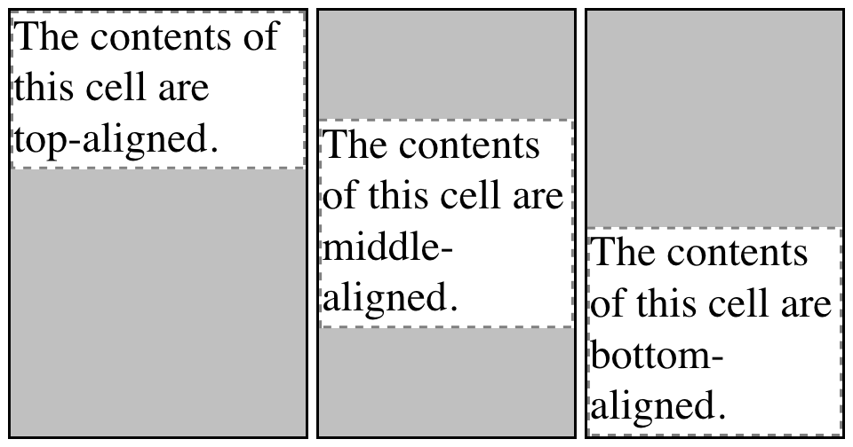

每种情况中，都通过增加内边距来使文字对齐。如图所示的第一个单元格中，通过增加底部内边距来达到内容与顶部对齐的效果。第二个单元格中，多余的空间被均匀地分配给上下内边距。第三个单元格中，则是上内边距被修改了。

第四个可选值是 baseline，它比前三种要稍微复杂一些：

<ul>
<li>baseline</li>

单元格的基线与其所在行的基线相同；跨行单元格的情况，其基线与最靠顶部的单元格的基线相同。

</ul>

效果如图片 14-14 所示。

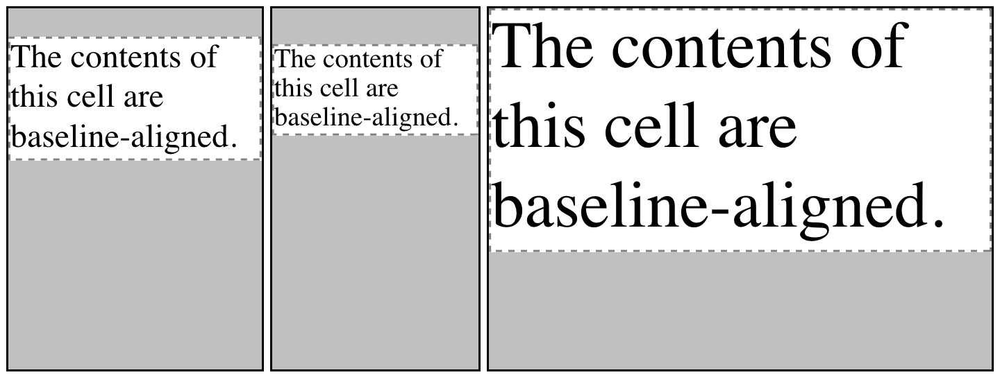

行的基线与行中每个单元格内容的最低基线为准（内容文本跨行的情况下，取首行文字的基线）。因此，图中这一行的基线以第三个单元格为准，其字体较大，内容文本的首行高度最高。其余两个单元格的基线均向第三个单元格看齐。

top、middle 和 bottom 的情况，会修改单元格的内边距来实现对齐。若单元格没有设置对齐属性，该行则没有基线 —— 因为不需要。

对齐单元格中的内容时，具体发生的过程如下：

<ol>
  <li>如果是基于准线的对齐，则确定行的基线并放置基线对齐单元格的内容。</li>
  <ol>
    <li>
      任何顶部对齐的单元格都已放置其内容。
      该行现在有一个临时高度，由已放置其内容的单元格的最低单元格底部定义。
    </li>
    <li>
      如果任何剩余的单元格是中间或底部对齐的，并且内容高度高于临时行高，则行的高度会增加以包含这些单元格中最高的单元格。
    </li>
    <li>
      所有剩余的单元格都放置了它们的内容。
      在内容短于行高的任何单元格中，单元格的填充会增加以匹配行高。
    </li>
  </ol>
</ol>

其余 vertical-align 的值 sub、super、text-top 和 text-bottom 赋值给表格时会被忽略。

## 总结

即使您通过多年的表格和间隔设计对表格布局非常熟悉，但事实证明驱动这种布局的机制相当复杂。 由于 HTML 表格构造的遗留问题，CSS 表格模型以行为中心，但值得庆幸的是，它确实可以容纳列和有限的列样式。 由于影响单元格对齐和表格宽度的新功能，您现在拥有更多工具来以令人愉悦的方式呈现表格。(g-t)

将与表格相关的显示值应用于任意元素的能力打开了使用 HTML 元素（例如 div 和部分）或在 XML 语言中创建类似表格布局的大门，其中任何元素都可以用来描述表格组件。(g-t)
